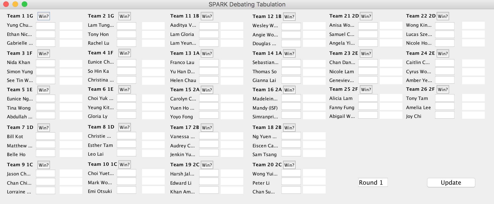

# SPARK-Debate-Tabulation
Tabulation Software to powerpair individual debaters, rather than the usual power-paring teams. 

After inputting data from each round, it will calculate each debater's score according to the guidelines set out by the Committee (see https://docs.google.com/document/d/1b-56Oz6AF7Titg1omOTMf2hcbunyQ43Cml5lS0dmGeM/edit?usp=sharing), and rearrange them into the new rooms fo the next round. 

After 4 rounds, the 6 debaters with the highest scores will be highlighted for the Grand Final

### Screenshots

